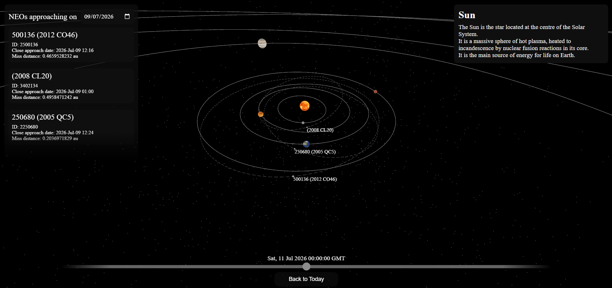

# Near Earth Object Visualizer

A 3D visualization of the Solar System that displays the positions of planets and Near Earth Objects (NEOs) using real orbital data from NASA.



## Technologies Used

HTML, CSS, JavaScript

Three.js

Vite

NASA Near Earth Object Web Services (NeoWs)

## Data Sources

Planetary positions were computed using the article published by the NASA JPL on approximating positions of the planets.

https://ssd.jpl.nasa.gov/planets/approx_pos.html


Asteroid/ NEO information is retreived from NASA's Near Earth Object Web Services (NeoWs)

https://api.nasa.gov/

## Installation

Clone the repository

```bash
git clone https://github.com/Adithyan-Kunnummal/near-earth-object-visualizer.git
```

Navigate into the project

```bash
cd near-earth-object-visualizer
```

Install dependencies

```bash
npm install
```

Create a `.env` file

```env
VITE_NASA_API_KEY=YOUR_API_KEY
```

Run the server

```bash
npx vite
```